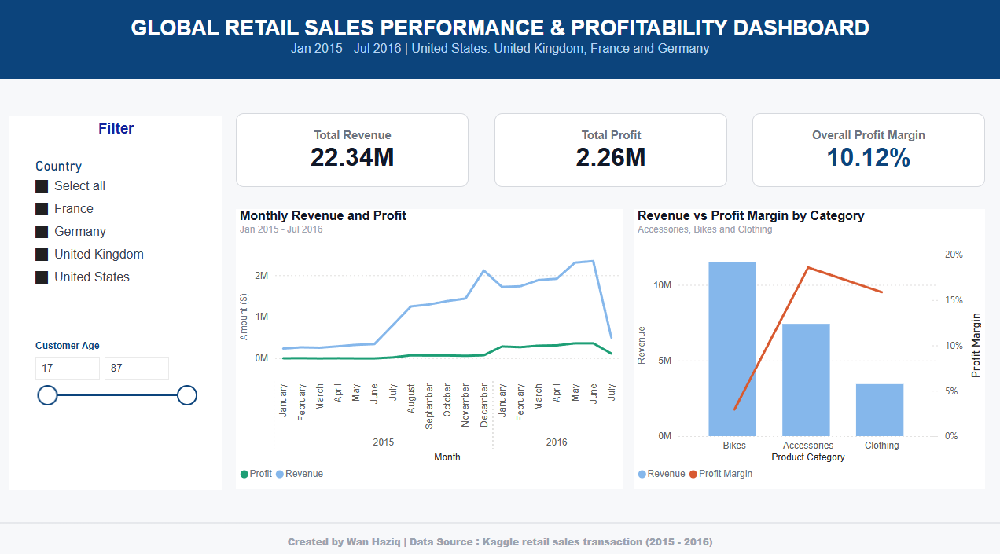

# Global Retail Sales Performance & Profitability Dashboard

Cleaned and analyzed 34,000+ retail transactions to uncover revenue and profit margin drivers across regions, product categories, and customer segments — then built an interactive Power BI dashboard for stakeholder reporting.

*(Screenshot of the Power BI dashboard — add your exported image here)*

## Problem Statement

A multinational retailer selling Accessories, Clothing, and Bikes across the US, UK, France, and Germany lacked a consolidated view of where the business was actually profitable. Leadership needed a way to see revenue and margin performance by region, product, and customer segment in order to guide marketing and inventory decisions — without needing to query raw data themselves.

## Dataset

- **Source:** [Kaggle — Sales for Course](https://www.kaggle.com/) retail transactions dataset
- **Size:** 34,866 transactions (after cleaning), 15 columns
- **Coverage:** January 2015 – July 2016, across the United States, United Kingdom, France, and Germany
- **Fields:** transaction date, customer age and gender, country/state, product category and sub-category, quantity, unit cost/price, and total cost/revenue

## Approach

1. **Data Cleaning (Python / pandas)** — removed a blank row, dropped an unused column, corrected data types, verified no duplicates existed, and derived Profit and Profit Margin from Revenue and Cost.
2. **Exploratory Data Analysis (Python / matplotlib)** — analyzed performance by product category, country, gender, age group, and month to surface key trends.
3. **Dashboard Build (Power BI)** — built an interactive dashboard with KPI cards, a monthly revenue/profit trend chart, a category-level revenue-vs-margin chart, and Country/Age slicers for stakeholder-driven exploration.

## Key Findings

- **Bikes generate the most revenue but the weakest margin (~2.9%)**, while Accessories brings in less revenue but the strongest margin (~18.6%) — a classic high-revenue, low-margin pattern worth flagging for pricing review.
- **The United States drives the most revenue but has one of the weakest margins (~6.8%)**, while Germany produces less revenue but is by far the most profitable market (~22.6% margin).
- **Customers aged 25–44 make up the majority of revenue**, making this the core demographic for marketing focus.
- **Profitability improved substantially from 2015 into 2016** — profit grew faster than revenue over time, indicating improving margins rather than just sales growth.

## Skills Demonstrated

**Technical:** Python (pandas, matplotlib), data cleaning and validation, DAX measures, Power BI dashboard development, Git/GitHub version control

**Analytical:** profitability analysis, customer segmentation, geographic and category performance analysis, stakeholder-facing data storytelling

## How to Run This Project

1. Clone this repository
2. Open `Sales Data for Economic Analysis.ipynb` in Jupyter/VS Code to view the data cleaning and EDA steps (requires Python, pandas, numpy, matplotlib)
3. Open `Sales Data for Economic Data Analysis.pbix` in Power BI Desktop to explore the interactive dashboard

## Data Source

Dataset sourced from Kaggle. This project was built as a self-directed portfolio piece to practice end-to-end data analysis, from raw data to a stakeholder-ready dashboard.

---
*Created by Wan Haziq*
